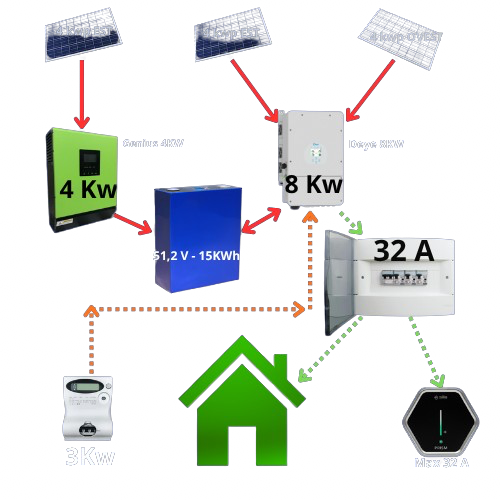

<p align="center">
  
</p>
<p align="center">
  
</p>
<br>


## Script Dinamico di Ricarica Wallbox per Home Assistant


**Autore:** bpirasATgmailDOTcom
**Versione:** 2025.11.0

**Attenzione!!** Consiglio l'utilizzo ad utenti "ESPERTI"

## Descrizione

Questo script Python per Home Assistant fornisce un controllo dinamico su una wallbox per veicoli elettrici (EV), ottimizzando la ricarica in base ai dati in tempo reale di un impianto fotovoltaico (FV), una batteria di accumulo domestica e il consumo complessivo dell'abitazione. È pensato per gli utenti che desiderano massimizzare l'autoconsumo di energia solare per la ricarica del proprio veicolo, senza immettere energia in rete.

Lo script regola intelligentemente la corrente di carica fornita al veicolo, tenendo conto di:
- Produzione totale di energia fotovoltaica.
- Stato di carica (SOC) della batteria domestica e sua velocità di carica/scarica.
- Consumo energetico totale dell'abitazione.
- Limiti configurabili per prevenire il sovraccarico dell'impianto elettrico.

Si consiglia di eseguirlo tramite un'automazione di Home Assistant a intervalli frequenti (es. ogni 45 secondi) per garantire una risposta quasi in tempo reale alle mutevoli condizioni.

## Funzionalità
- **Regolazione Dinamica della Potenza**: Imposta automaticamente la corrente di carica della wallbox in base all'energia solare in eccesso disponibile.
- **Ricarica Consapevole della Batteria**: Può dare priorità alla ricarica della batteria di casa o condividere l'energia tra la batteria e il veicolo in base a soglie SOC definite dall'utente.
- **Protezione del Sistema**: Monitora la corrente totale assorbita dalla casa e può mettere in pausa la ricarica per evitare di far scattare l'interruttore principale.
- **Configurabile**: Tutti gli ID delle entità e i parametri operativi chiave sono centralizzati in un dizionario `CONFIG` per una facile personalizzazione.
- **Sensore di Stato**: Crea e aggiorna un sensore dedicato in Home Assistant (`sensor.wallbox_status`) per fornire una panoramica in tempo reale dello stato di ricarica, dei flussi di energia e della logica decisionale.
- **Modalità Debug**: Include una modalità di debug per facilitare la risoluzione dei problemi.

## News
Modifiche 01/11/2025:
- 🧹 REFACTOR: Rivista completamente la struttura dello script e applicata una sintassi più leggibile e manutentabile.
- 🆕 FEATURE: Inserite notifiche permanenti su Home Assistant per la EV Emergency e l'assenza di rete elettrica.
- 🚀 MIGLIORIA: Varie.

Modifiche 30/10/2025:
- 🆕 FEATURE: **Implementato Margine Dinamico di SOC (Emergenza EV)**. 
  Se l'EV SOC scende sotto una soglia critica (`input_number.ev_soc_emergenza`), 
  lo script forza la carica minima (6A) e ignora le pause (Pausa Oraria e SOC Batteria Casa Critico).
- 🛡️ SAFETY CHECK: Migliorata la lettura del sensore `ev_soc` per prevenire l'attivazione 
  accidentale della carica di emergenza se il sensore dell'auto non è disponibile (imposta 100% di default).
- 🚨 CONTROLLO CRITICO: **Aggiunto controllo Grid/Batteria Bassa**. Lo script si ferma e mette in pausa la Wallbox se la rete elettrica è assente e il SOC della batteria è inferiore a `wboxsocmin`. Priorità alla stabilità del carico domestico.
- 🧹 REFACTOR: Aggiunta la lettura dello stato della Grid nella funzione `get_system_state`.
- FEATURE: Aggiunta informazione di presenza rete sul sensore Wallbox Status, riviste le infomazioni del sensore e tradotte in linguaggio compresnibile.
- 🐞 FIX CRITICO: **Corretta la logica di attivazione dello SCENARIO 9** (Scarica batteria eccessiva). Lo scenario ora viene bypassato in presenza di surplus fotovoltaico significativo (pv_excess >= 100W) e SOC batteria alto, evitando la pausa anomala in caso di squilibri di bilanciamento dell'inverter.
- 🚀 MIGLIORIA: **Migliorata la logica di SCENARIO 14** (Pausa per corrente bassa) per includere la potenza calcolata (`available_power`) nel messaggio di debug, offrendo maggiore chiarezza diagnostica.

Modifiche 29/10/2025:

- ✍️ LOGGING: Implementata la funzione di logging warning per alcuni messaggi importanti.
- FEATURE: Aggiunta logica 'predittiva' che stima la produzione FV potenziale per un avvio più rapido e intelligente.
- FEATURE: Aggiunta logica 'attiva' per stimolare la produzione FV a batteria carica e surplus nullo.
- FIX: Corretta la logica 'MAX CHARGE FORZATA' per utilizzare la potenza FV in eccesso reale invece di un valore fisso.
- FEATURE: In caso di scarica eccessiva della batteria, la potenza viene ridotta dinamicamente invece di fermare la carica.
- FEATURE: Aggiunti log di debug dettagliati per tutte le principali decisioni dello script.
- FEATURE: Implementata logica per stimolare l'avvio del secondo inverter 'dormiente' stimando la sua produzione potenziale e aggiungendola al surplus calcolato.
- 🚀 MIGLIORIA: Aggiunta logica di logging estesa in *ogni* punto decisionale critico per una diagnostica completa.
- ⚡ PERFORMANCE: **Ottimizzazione delle chiamate a servizio** rimuovendo `blocking=True` dove non essenziale per evitare rallentamenti del core HA.
- 🧹 REFACTOR: Semplificazione del calcolo della durata dello script tramite timestamp Unix.

Modifiche 27/10/2025:

- FIX: Ripristinato lo stato 'Non Collegato' quando la wallbox è in idle, come nel comportamento originale.
- HOTFIX: Corretto un errore di battitura (typo) che causava il crash dello script.
- REFACTORING: Suddivisione della logica in funzioni per migliore leggibilità e manutenibilità.


## Installazione

1.  **Copia lo Script**: Inserisci lo script `wallbox_charging_control.py` nella cartella `/config/python_scripts/` della tua installazione di Home Assistant.
2.  **Crea gli Helper**: In Home Assistant, crea tutti gli `input_boolean`, `input_number`, e `input_datetime` necessari, definiti nella sezione `CONFIG` dello script. Questi sono usati per controllare e monitorare il comportamento dello script (Se vuoi, puoi usare il file `package_wallbox.yaml` per crearli automaticamente da rinominare e inserire nella cartella packages).
3.  **Crea i Sensori Template**: Crea eventuali sensori template richiesti elencati nella sezione `CONFIG` (se usi il file package, Home Assistant li crea da solo).
4.  **Crea la cartella packages (se già non esistente) dove copiare al suo interno il file package_wallbox.yaml.example e rinominare in  package_wallbox.yaml (riavviare Home Hassistant al termine).
5.  **Automatizza l'Esecuzione**: Crea una nuova automazione in Home Assistant che chiami il servizio `python_script.wallbox_charging_control` a intervalli regolari (di solito 45 sec sono sufficienti).

    ```yaml
    alias: "Run Wallbox Charging Control"
    trigger:
      - platform: time_pattern
        seconds: "/45"
    action:
      - service: python_script.wallbox_charging_control
    mode: single
    ```
